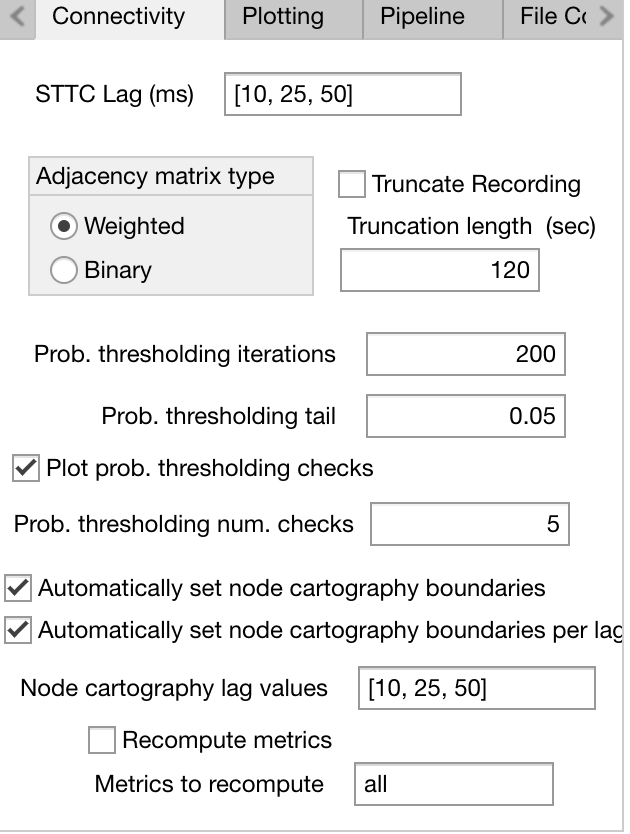
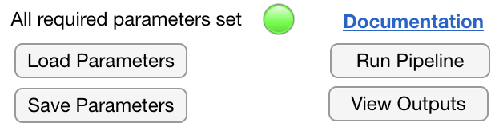
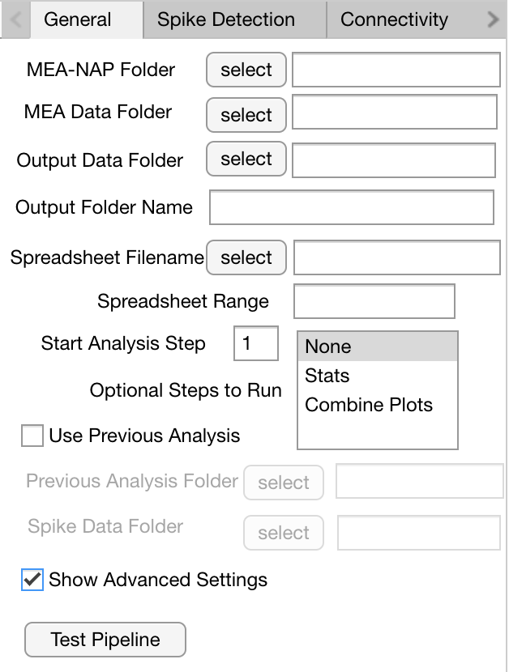

Guide for New Users 
=====================

If you have **limited or no experience with MATLAB**, we recommend using our interactive GUI mode. 
This mode simplifies the process of selecting directory paths and adjusting parameters for the pipeline. 

The GUI will guide you through the following aspects of MEA-NAP: selecting the folder locations of the MEA-NAP folder, your MEA data, your batch analysis CSV file; indicating what type of MEA data (i.e., Multichannel Systems 60 electrode or Axion Biosystems 64 electrode); and adjusting spike detection, network connectivity, and plotting settings. 

=========================

Overview of MEA-NAP
----------------------------------------------------------------

The pipeline has the following steps:

1. Spike detection (this step can be skipped if done previously)
2. Comparison of the neuronal activity (e.g., firing rates, burst rates)
3. Inferring the functional connectivity
4. Comparison of the network activity (i.e., graph theoretical metric)
5. Statistical analysis (e.g., feature correlation and classification)

Starting MEA-NAP 
------------------

- Open MATLAB.
- Open MEApipeline.m.

.. image:: imgs/MEApipeline.png
   :width: 700 
   :align: center

- Start GUI by clicking green "Run" button in "Editor" submenu at the top of your screen 

.. image:: imgs/run_button.png
   :width: 200 
   :align: center

User input for GUI
-------------------

.. raw:: html

   

1. General parameters
^^^^^^^^^^^^^^^^^^^^^^^^^^^^^^

.. image:: imgs/general_gui.png
   :width: 350 
   :align: center 

.. raw:: html

   

- **MEA-NAP Folder:** Location of the MEA-NAP folder you downloaded from our Github page. *Important: there may be a brief pause before the file browser appears after you click the select buttons in the GUI. Do not click on other parts of the GUI during this pause. Otherwise, you may need to close the GUI, clear the workspace, and run MEA-NAP again.*
- **Raw Data Folder:** Location of the folder with **your raw data in .mat format.** All of the recordings that you want to analyze in one experiment should be in the same folder. If you have not converted your raw data to .mat format (see Setting up MEA-NAP for instructions on using the GUI's File Conversion tab).
- **Output Data Folder:** Location of the folder where the figures and analysis files will be saved.
- **Spreadsheet Filename:** Your .csv file with the list of recording filenames you want analyzed, age and group (e.g., genotype). *Important: There will be a few seconds long pause while MEA-NAP imports data from the .csv file. Do not click on anything else in the GUI while it is uploading. Otherwise, you may need to close the GUI, clear the workspace, and run MEA-NAP again.*
- **Spreadsheet Range:** Range (``[StartRow EndRow]``)of CSV file to read data from (e.g. ``[2 Inf]`` would start reading data from row 2)
- **Start Analysis Step:** MEA-NAP can be run starting at different steps using prior analysis.  Input should be a number.  1 - Spike Detection, 2 - Neuronal Activity (firing rate and burst properties), 3 - Functional Connectivity, 4 - Network Activity, 5 - Statistical comparisons.  Steps 2-5 require prior spike detection.  Steps 4-5 require step 3.
- **Optional Steps to Run:** Optional steps to run (require Steps 1-4).  For Step 5, select "Stats." n.b. "Combine plots" will combine network plots for all DIVs from the same recording in a folder at the end of Step 4 if the recording filenames are formatted appropriately.
- **Previous Analysis Date:** MEA-NAP output folders are name ``OutputDataDDMonYYYY`` (e.g., ``27Sep2022``). If using prior analysis from MEA-NAP, enter date in this format.
- **Previous Analysis Folder**: Location of the previous output folder generated by MEA-NAP
- **Spike Data Folder:** Location of the folder containing spike .mat files generated during spike detection by MEA-NAP.  This folder is labeled Step 1A.
- **Show Advanced Settings:** Checking this box will show additional tabs at the end of the GUI for Advanced Users.  New users should leave this box unchecked.

.. raw:: html

   

2. Spike detection parameters
^^^^^^^^^^^^^^^^^^^^^^^^^^^^^^^^^^^^

.. image:: imgs/spike_detection_gui.png
   :width: 350 
   :align: center 

.. raw:: html

   

- **Detect Spikes:** Check if starting at Step 1 with Spike Detection or running spike detection checks on previous spike detection.  Uncheck if using prior spike detection
- **Sampling frequency:** This is the acquisition rate (in hertz) used when you collected your data.  For example, with our MCS MEA systems, we collect data at 25000 Hz. For the Axion MEA system, we collect data at 12500 Hz. If you converted your raw data files to .mat using MEA-NAP's conversion tool, you can open the .mat file in MATLAB and see the sampling frequency (data acquisition rate) in the variable labeled "fs." The sampling rate is calculated during the conversion process for our tool.
- **Down Sample Frequency:** Down-sampling factor for plotting spike detection checks in Step 1B. For most analyses, no down sampling is necessary. Thus, set this to be equal the Sampling Frequency.
- **Potential Difference Unit:** Unit for voltage signal.  Enter V for volts or uV for microvolts.  Our MCS MEA systems record the data in uV.  Our Axion MEA system records the data in V.
- **Channel Layout:** MCS60 (for MEA2100, 60-electrode MEA chip), Axion64 (for 6-well plates), or MCS60old (for MEA1600, 60-electrode MEA chip). "Custom Layout" can also be selected.  Instructions for creating a custom layout can be found :ref:`here <custom_layout>`.
- **Thresholds:** Mean absolute deviation multiplier threshold(s) to use for threshold-based spike detection (e.g., ``[3, 4, 5]``)
- **Wavelets:** For template-based spike detection, select one or more wavelets (e.g., bior1.5, bior1.3, db2) for continuous wavelet transform or swtteo for stationary wavelet transform method.  Bior1.5 works well for most neuronal data.
- **Wavelet Cost:** The false positive / false negative tradeoff for template-based spike detection.   Value must be between -2 to 2.  Recommend starting with -0.12.
- **Spike Method for Analysis:** Select spike detection method(s) to use for Steps 2-4.  To use one threshold, enter "thr" followed by the number entered in Threshold.  To use one wavelet, enter wavelet name substituting p for a period (e.g., bior1p5).  For multi-unit spike detection, enter mergedAll to combine spike detection from all methods selected (thresholds and wavelets) or mergedWavelet to combine spike detection from all the wavelets selected for template-based spike detection.
- **Run spike check on previous spike data:** If starting with Step 1B, check this box to create the spike detection check plots on previously analyzed data.

3. Connectivity parameters
^^^^^^^^^^^^^^^^^^^^^^^^^^^^^^^^

.. raw:: html

   

- **STTC Lag (ms)**: Select one or more lag values (in milliseconds) for the spike time tiling coefficient. The STTC lag determines the time window for inferring functional connectivity.  Default is [10, 25, 50] 
- **Adjacency matrix type:** Weighted (default) uses edge weights (strength connectivity) for calculation of network metrics.  Binary treats all edges (strong or weak) as the same in calculation of network metrics.
- **Truncate Recording:** Default unchecked.  Check if you want to analyze only the first part of your recordings.  This can speed up analysis time, especially if recordings are more than 10 minutes.
- **Truncation length:** If Truncate Recording is checked, indicate length in seconds of recordings to analyze.  Truncating the recording can be useful for comparing spike detection methods.  However, it can significantly change the functional connectivity and downstream network metrics.
- **Prob. thresholding iterations:** Number of times circular shifts (iterations) are performed for each edge for probabilistic thresholding,  Default is 200 repeats
- **Prob. thresholding tail:** Percentile used for determining significant edge.  To determine significant edges where the real edge weight is greater than the 95th percentile of the edge weights from the circular shifts, enter 0.05. To determine significance where the real edge weight is greater than the 99th percentile, enter 0.01.
- **Prob. thresholding num. checks:** Number of MEA recordings for which to plot the probabilistic thresholding check
- **Node cartography lag values:** Subset of STTC Lag values (in ms) for performing the node cartography analysis. If node cartography should be calculated for all STTC lags performed, list all values from STTC Lag (ms). Default is [10, 15, 25].

4. Plotting parameters
^^^^^^^^^^^^^^^^^^^^^^

.. image:: imgs/plotting_gui.png
   :width: 350 
   :align: center 

.. raw:: html

   

- **Figure formats:** Select one or more file formats for the plots that MEA-NAP produces. Options are .png (easy to view with web or picture browser), .svg (good for creating figures or presentations), and MATLAB format (.fig). For other image formats, see Guide for Advanced Users.
- **Do not compress SVG:** Leave checked to create SVG files suitable for creating figures.
- **Display only one figure:** Leave checked to prevent MATLAB from creating separate figure windows for each figure as MEA-NAP runs.
- **Raster Map Upper Percentile:** In Step 2, the firing rates for each MEA recording are plotted using the same scale from 0 Hz to this upper percentile of the maximum firing rates for the entire dataset.  Enter an integer **value between 0 and 99.**
- **Include NotBoxPlots:** If checked, notBoxPlot figures will be generated in Step 2B and Step 4B in addition to the half-violin plots.
- **Include channel number in plots:** If checked, will print the channel (electrode ) ID number over the node in select figures.  This can be useful if you want to confirm you have used the correct Channel Layout (Spike Detection Parameters).
- **Colormap settings:** In Step 4A plots with color bars, the scale is set to the individual recording or the entire dataset in the other plot. If "Use theoretical bounds" is checked, then the same scale bar will be used for both plots.  However, the scaling of the node size and edge weight (line thickness) will still be specific to the individual recording and the entire dataset.  "Use min max..." check boxes are potential feature requests that may be available in future versions of MEA-NAP

Saving and loading parameters 
-------------------------------
- Once all the required parameters have been set, the button at the bottom of your window should switch from red to green.
- At any point before running MEA-NAP, click “Save parameters” at the bottom of your window to save your selected parameters. **When using MEA-NAP again, click “Load parameters” to reuse these parameters.**  This can be very useful when re-running different data sets.  

.. raw:: html

   

- Sample saved parameter files for running Axion 64-electrode MEA data starting from Step 1 (MEANAP-Params-Axion64MEA.mat) and Step 2 (MEANAP-Params-Axion64MEA-startStep2.mat) are included on the Github.  
- If you have run MEA-NAP previously on the same day, MEA-NAP **will prompt you to rename the first Output folder (e.g., v1) when it starts running.**

Notes on selecting parameters for new users
---------------------------------------------
- The choice of parameters depends on your data and scientific question. Thus, it is helpful to use the validation plots in MEA-NAP to confirm which parameter choices are appropriate for your data (see MEA-NAP methods, https://analysis-pipeline.readthedocs.io/en/latest/meanap-methods.html, for more detail).  
- One strategy is to run MEA-NAP in steps to help you determine the choice of parameters.
- First, we recommend identifying the spike detection parameters that have the best sensitivity and specificity for your data.  For example, start with Step 1 with multiple threshold (e.g., 4, 5) and wavelets (bior1.5, bior1.3, db2) selected. Then stop MEA-NAP after Step 1B is completed. (If you have the Output Folder open in your file browser, you can see when MEA-NAP has started to add plots to Step 2, and you can hit the stop button on MATLAB). You can then look at the plots in Step 1B - Spike Detection checks. Spike Detection, particularly for multiple methods/parameters, is typically the longest step to run in MEA-NAP.  For example, using a desktop computer (Intel i5-4570 CPU 3.20Ghz processor with 32 GB RAM running Windows 10 Pro), the spike detection for 2 thresholds and 3 wavelets on 10-minute-long recordings collected at 12.5kHz from 64-electrode MEAs took about 24 minutes per recording. 
- You will then be able to start MEA-NAP again using the previously spike detected data and choose the appropriate Spike Detection method/parameter for the downstream analysis (Step 2 - 5). 
- With your next MEA-NAP run, you can determine what spike time tiling lag (STTC) is appropriate for your data.  You can run for 10, 25, and 50 ms, for example.  Here, selecting only one image type (e.g., .png) is helpful to reduce run time.  After looking through comparison plots by lag, you can could rerun the pipeline starting at Step 4 for one lag and select plot output type as .svg, for example, to be able to use these plots in creating figures in Illustrator, Powerpoint, or other software. 

Notes for users of Axion 48-well MEA plates with 16 electrodes per well
------------------------------------------------------------------------

The default minimum number of nodes for performing network analysis is 25 for 60- or 64-electrode MEAs and 12 for 16-electrode MEAs.
Users can change the minimum number of nodes if desired in the Advanced Settings by following the steps below.

Changing the number of nodes (electrodes) used for network analysis
^^^^^^^^^^^^^^^^^^^^^^^^^^^^^^^^^^^^^^^^^^^^^^^^^^^^^^^^^^^^^^^^^^^^^^^^^^^^^^^^

1. Leave "Show Advanced Settings" option checked on GUI's General tab.

.. raw:: html

   

2. Go to GUI's Advanced Connectivity tab and adjust parameters.

.. raw:: html
   

- **Exclude edges below threshold:** Leave checked to exclude edges with weights below a defined threshold when calculating network metrics. 
- **Minimum number of nodes:** Minimum number of nodes (electrodes) that must be connected to calculate network metrics. 
- **Network metrics to calculate:** Select one or more network metrics to calculate during Step 4 (see MEA-NAP methods, https://analysis-pipeline.readthedocs.io/en/latest/meanap-methods.html, for more detail).

