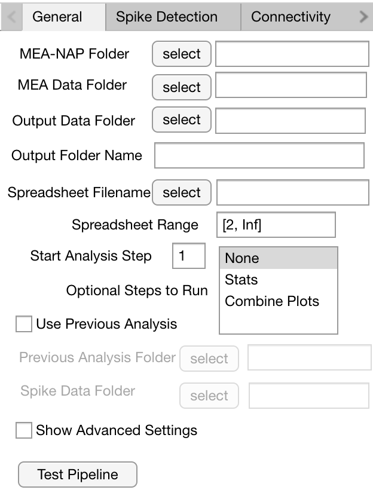

Guide for New Users 
=====================

If you have **limited or no experience with MATLAB**, we recommend using our interactive GUI mode. 
This mode simplifies the process of selecting directory paths and adjusting parameters for the pipeline. 

The GUI will guide you through the following aspects of MEA-NAP: 
- Selecting the folder locations of the MEA-NAP folder, your MEA data, your batch analysis file (.csv or .xlsx)
- Indicating what type of MEA data (i.e., Multichannel Systems 60 electrode or Axion Biosystems 64 electrode) 
- Adjusting spike detection, network connectivity, and plotting settings 

Overview of MEA-NAP
----------------------------------------------------------------

The pipeline has the following steps:

1. Spike detection (this step can be skipped if done previously)
2. Comparison of the neuronal activity (e.g., firing rates, burst rates)
3. Inferring the functional connectivity
4. Comparison of the network activity (i.e., graph theoretical metric)
5. Statistical analysis (e.g., feature correlation and classification)

Starting MEA-NAP 
------------------
- Open MEApipeline.m

- Set **Params.guiMode = 1** (line 76 of MEApipeline.m)

.. image:: imgs/param_gui.png
   :width: 400 
   :align: center

- Start GUI by clicking green "Run" button in "Editor" submenu at the top of your screen 

.. image:: imgs/run_button.png
   :width: 200 
   :align: center

User input for GUI
------------------

.. raw:: html

   

1. General MEA-NAP Parameters
^^^^^^^^^^^^^^^^^^^^^^^^^^^^^^

.. raw:: html

   

Required parameters

- **MEA-NAP Folder**: Location of the MEA-NAP folder with the AnalysisPipeline scripts (Best not to save in Program Files)
- **Optional Steps to Run**: Optional step to run downstream required steps of the pipeline (steps 1-4)
- **Output Data Folder**: Location of the folder where your output data will be saved
- **Raw Data Folder**: Location of the folder with the raw data .mat files
- **Spreadsheet filename**: Input file with a list of recordings with their age and genotype
- **Spreadsheet Range**: Range (``[StartRow EndRow]``)of CSV file to read data from (e.g. ``[2 Inf]`` would start reading data from row 2)
- **Start Analysis Step**: Step of MEA-NAP that you would to start running from. Steps 2-4 all require spike detection (step 1) to run. Step 4 requires Step 3. Step 5 requires step 4.

Optional parameters (if previous analysis has been performed)

- **Previous Analysis Date**: Prior analysis date in format given in output data folder e.g., '27Sep2021'
- **Previous Analysis Folder**: Location of the previous output folder generated by MEA-NAP
- **Spike Data Folder**: Location of the folder containing spike .mat files generated during spike detection (step 1)

.. raw:: html

   

2. Spike Detection Parameters
^^^^^^^^^^^^^^^^^^^^^^^^^^^^^^^^^^^^

.. raw:: html

   

- **Channel Layout**: MCS60 (for MEA2100), Axion64 (for 6-well plates), or MCS60old (for MEA6100)
- **Down Sample Frequency**: Downsampling factor for your recording. Its value should match the sampling frequency.
- **Potential Difference Unit**: Unit for voltage signal (e.g., MCS: uV, Axion: V)
- **Sampling Frequency**: Sampling frequency of your recording
- **Spike Method for Analysis**: Spike detection method to use for steps 2-4 of the pipeline
- **Thresholds**: Standard deviation multiplier threshold(s) to use for threshold-based spike detection (e.g., ``[3, 4, 5]``)
- **Wavelet Cost**: false positive / false negative tradeoff for wavelet spike detection. Value must be between -2 to 2
- **Wavelets**: Wavelet methods to use for wavelet-based spike detection

3. Connectivity Parameters
^^^^^^^^^^^^^^^^^^^^^^^^^^^^^^^^

.. image:: imgs/connectivity_gui.png
   :width: 500 
   :align: center 

.. raw:: html

   

- **Adjacency matrix type**: Type of adjacency matrix to obtain during functional connectivity analysis
- **Node cartography lag values**: List of lag values (in ms) for functional connectivity analysis. Default is [10, 15, 25].
- **Prob. thresholding iterations**: Number of repeats for probabilistic thresholding
- **Prob. thresholding num checks**: Number of random checks to plot during proabilistic thresholding
- **Prob. thresholding tail**: Probabilistic thresholding percentile threshold 
- **STTC Lag (s)**: List of spike time tiling coefficient lag values. Default is [10, 25, 50]
- **Truncation length (s)**: Length (in s) for shortened recordings. This parameter can significantly change the connectivity estimates.

4. Plotting Parameters
^^^^^^^^^^^^^^^^^^^^^^

.. image:: imgs/plotting_gui.png
   :width: 500 
   :align: center 

.. raw:: html

   

- **Figure formats**: Format of the plots that MEA-NAP produces. Options are ``.fig``, ``.png``, and ``.svg``.
- **Raster Map Upper Percentile**: Value **between 0 and 1** that is used as maximum value for scaled firing rates. Firing rates in raster plots are scaled from 0 spikes/s to this percentile.

Saving and Loading Parameters 
------------------------------
- Once all the required parameters have been set, the button at the bottom of your window should switch from red to green.
- Before running MEA-NAP, click "Save parameters" at the bottom of your window to save your selected parameters. **In subsequent runs, click "Load parameters" to reuse these parameters.**

.. image:: imgs/save_parameters_gui.png
   :width: 400 
   :align: center 

.. raw:: html

   

