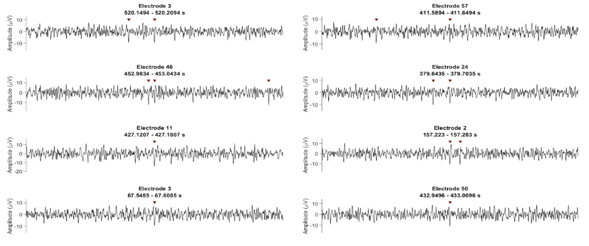
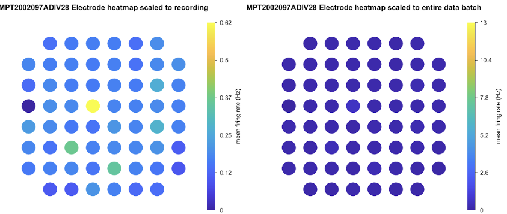
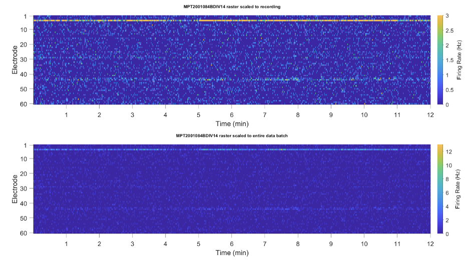
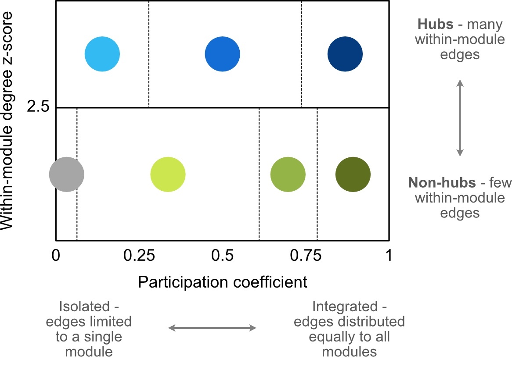

MEA-NAP Methods
=========================================================

- The pipeline has the following steps:

  1. Spike detection (this step can be skipped if done previously)

  2. Comparison of the neuronal activity (e.g., firing rates, burst rates)

  3. Inferring the functional connectivity

  4. Comparison of the network activity (i.e., graph theoretical metric)

  5. Statistical analysis (e.g., feature correlation and classification)

Spike detection
-----------------------------------------------------------------

Microelectrode array (MEA) recordings offer the temporal resolution to identify individual action potentials from multi-unit activity detected at individual electrodes.  There are many different methods available for detecting action potentials from extracellular voltage recordings. The choice of methods and parameters need to be optimized for each data set, as type of tissue, level of activity, and level of electrical noise will affect the accuracy.  The gold standard for tuning spike detection is comparing MEA recordings from the same network before and after tetrodotoxin (TTX) administration (if your neuronal population is sensitive to action potential blockade by TTX, **Figure 1.1**). TTX inhibition is use-dependent, thus depending how frequently the neurons fire action potentials, it may take a few minutes before all neuronal firing stops in the presence of TTX.

.. image:: imgs/spike_detection.png
    :width: 640
    :align: center

**Figure 1.1. Effect of tetrodotoxin (TTX) on spikes detected by MEA.** Histogram (upper) of spiked detected and raster plot for three electrodes before TTX (left) and after TTX was added (to the right of the dashed line) abolishing all action potentials.

Spike detection methods in the pipeline
^^^^^^^^^^^^^^^^^^^^^^^^^^^^^^^^^^^^^^^^^^^^^^^^^

The pipeline offers multiple options for spike detection including template-based and threshold-based methods **(Figure 1.2)**. The template-based method uses a continuous wavelet transform to identify action potentials by their waveform. In our 2D primary murine cortical cultures, the template-based method outperforms threshold-based methods in both sensitivity and specificity (Dunn et al., FENS 2020, poster). However, depending on the signal-to-noise ratio and/or the fit of the template to action potentials in a recording, the template method may not perform well on all data.  In this case we recommend using a threshold-based method. The user selects the standard deviation multiplier for detecting spikes. Minimum and maximum spike amplitudes are included to remove noise and large electrical artifacts.

.. image:: imgs/spike_detection_methods.png
    :width: 400
    :align: center

**Figure 1.2. Template- and threshold-based methods for spike detection.** Sample voltage trace (black) with colored arrows for spikes detected with different templates (blue) or thresholds (red).  Sample template bior1.5 shown in blue box (inset).  Spike amplitude thresholds based on the standard deviation (SD) are shown as dashed lines. Some spikes are detected by 1, 2 or 4 of the methods.

**Threshold-based options**

For each electrode in an MEA recording, the median absolute deviation of the voltage signal is calculated. In the threshold-based method used for this pipeline the user can set the median absolute deviation (MAD) multiplier (e.g., 4.5, 5) as a threshold for detecting negative voltage deflections that exceed this threshold. As the spike detection is based on the amplitude, it does not distinguish between changes in voltage that have a waveform consistent with action potentials versus electrical noise. Maximum absolute threshold values are added to avoid counting large electrical artifacts as spikes. Minimum absolute thresholds can also be set by advanced users.  Advanced users can also use thresholds based on standard deviation (SD) multipliers if desired.

At a biological level, the threshold method also has a challenge when comparing activity between electrodes within a recording, or comparing recordings, where there is a low level of activity versus a very high level of activity.  If there are infrequent spikes with a low noise level, the threshold multiplier based on the standard deviation will set the threshold for spike detection at a smaller absolute amplitude for detecting spikes. If there is a high firing rate of action potentials, or dense firing within the recording sensitivity of the electrode (increasing the background variation in voltage signal), this can increase the absolute amplitude for detecting spikes for the same standard deviation multiplier. This leads to action potentials that are the same absolute amplitude as those detected as spikes in electrodes, or recordings, with lower firing rates not being detected as action potentials in the electrodes, or recordings, with higher firing rate. 
To address this, the pipeline saves the absolute voltage for each electrode based on the MAD multiplier.  If a TTX recording has been performed for the same culture, the absolute voltage for the MAD multiplier for each electrode can be used on the pre-TTX recordings to set a threshold based on the actual amplitude (rather than the MAD) in the post-TTX recording.  To compare pre- and post-TTX recordings using this approach, use the script at the end of the MEApipeline.m function (GUI mode off).

The pipeline also produces plots of the voltage traces with spikes detected marked with arrows from a random selection of electrodes. These plots allow one to quickly visually inspect the quality of the spike detection **(Figure 1.3)**.  Sample waveforms from single electrodes for the different methods are also plotted in the pipeline. Plots with comparison of the number of spikes detected over time are also produced. The pipeline allows multiple threshold multipliers to be run and these plots facilitate comparison and selection of the threshold for spike detection for downstream analysis.  These plots are in the OutputData subfolder \1B_SpikeDetectionChecks organized by group and recording.

**Figure 1.3. Evaluating spike detection at action potential scale in the pipeline.** Sample 60 ms-long traces from 8 electrodes show individual spikes detected by a MAD 3.5 threshold (red arrows).

**Template-based options**

The pipeline uses a continuous wavelet transform to identify spikes based on their similarity to selected wavelets. The user can select from built-in MATLAB wavelets (e.g., bior1.5, bior1.3, db) or custom electrode-specific wavelets created by the pipeline to detect the specific spike waveform(s) in the acquired data.  The MATLAB bior1.5 wavelet had the highest sensitivity for action potentials in our 2D primary murine cortical cultures. Bior1.3 is similar and detects many of the same spikes as well as additional unique spikes.  Although the wavelet db itself does not have a spike-like waveform, it is reasonable at detecting an additional small number of spikes with a waveform consistent with action potentials.

For the custom electrode-specific wavelet method created for our pipeline, first the threshold method is run (e.g., MAD 4).

.. image:: imgs/template_based_options_2.png 
    :width: 600
    :align: center

**Figure 1.4. Comparison of spike detection in 2D murine cortical culture before and after application of tetrodotoxin (TTX)**. Left panel, Heatmap of spike frequency (spikes per second) by electrode in the spatial organization of the MEA grid show spiking by electrode before and after TTX application. Right panel, scatter plots of spike rates by electrode shows higher specificity for the template method (blue, bior1.5 wavelet) than threshold (red, SD 4.5) based on few false spikes detected in the presence of TTX. (Figure adapted from Dunn et al.)

**Multi-unit spike detection**

Microelectrode arrays detect action potentials from multiple neurons on or within a 5-10 um radius of each electrode.  The action potentials detected by the electrode from different neurons in the multi-unit activity are likely to have different waveforms. Action potential kinetics vary due to cell-type and the distance from and orientation relative to the electrode. For example, the amplitude of action potentials from a neuron growing directly on the electrode is likely to be larger than the amplitude of a neuron growing 5 um away from the electrode.  To increase the sensitivity of spike detection for multi-unit activity, the pipeline allows the spikes detected by multiple templates to be merged.  This method identifies the peak negative amplitude for each spike and uses this to determine which spikes have been detected by multiple templates and which are unique spikes in order to avoid counting the same action potential multiple times when the spike detection is merged.  The merged method increases the sensitivity of the spike detection and accounts for the multi-unit activity.

Future directions for spike detection in pipeline
^^^^^^^^^^^^^^^^^^^^^^^^^^^^^^^^^^^^^^^^^^^^^^^^^^^^^

We are currently working to integrate into the pipeline a spike detection tool that can be used to validate and optimize spike detection parameters. This is particularly helpful for recordings where you have blocked activity with tetrodotoxin (TTX) or increased activity with stimulation (e.g., optogenetic) and wish to calibrate and/or compare spike detection between different recording conditions. This can be used for selecting methods and parameters for running spike detection in the pipeline. 

Comparison of neuronal activity
------------------------------------------------------------------------------

Firing rates
^^^^^^^^^^^^^^^^^^^^^^^^^^^^^^^^^^^^^^
One of the most common forms of analysis performed on MEA recordings from neuronal networks are estimates of the firing rate of action potentials detected at each electrode.  The pipeline facilitates these comparisons between electrodes within each recording and between recordings by age and genotype.  The figure outputs of the pipeline include heatmaps of the firing rate in the spatial organization of the electrodes as well as raster plots showing the temporal changes in firing rates (in 1 second time bins) by electrodes.  In the figures, the heat maps **(Figure 2.1A)** and raster plots **(Figure 2.1B)** are plotted twice, the first plot is scaled to the minimum and maximum values in that recording and the second plot (right or bottom panel) is scaled for all recordings in the batch analysis. The former allows the investigator to see the variation clearly within each recording. The latter facilitates comparison of firing rates across the whole dataset. 

**A.**

**B.**

**Figure 2.1. Firing rates for 12-minute recording scaled for recording and entire dataset.** **A.** Heat map of firing rates by electrode in spatial layout of MEA grid scaled for recording (left) and entire dataset (right). **B.** Raster plots scaled for this recording (top) and the entire dataset (bottom). The plots are in the OutputData folder in 2_NeuronalActivity/2A_IndividualNeuronalAnalysis.

Burst detection
^^^^^^^^^^^^^^^^^^^^^^^^^^^^^^^^^^^^^^^^

The term “burst” is used in multiple contexts within electrophysiology and within this pipeline.  Here we are concerned with two types of bursting activity in the MEA recordings.  As neurons develop in cultures, their action potential firing not only increases in frequency, but the timing of the action potentials comes in bursts.  Here burst is defined by a minimum number of action potentials occurring within a short inter-spike interval (ISI).  We do not currently have functions integrated into the pipeline for comparing bursting within individual electrodes. Instead, the pipeline currently analyzes “network bursts.” As neurons develop in culture, they not only change their pattern of firing over development, but they also fire more often when other neurons in the network are firing.  These network bursts are defined as a minimum number of action potentials occurring within a short ISI observed in a minimum number of electrodes.  Like the burst patterns observed in individual electrodes, the parameters for the network burst are chosen by the user and need to be optimized and validated to capture the temporally correlated spiking across multiple nodes in the network. There are many methods for network burst detection available. The default in MEA-NAP is to use the Bakkum method (Bakkum 2013) with N=10 (minimum number of spikes in a burst) in a minimum of the 3 seconds.  The method automatically determines the threshold (in milliseconds) based on the ISI distribution.

.. image:: imgs/burst_detection.png
    :width: 650
    :align: center

Inferring functional connectivity
--------------------------------------------------------------------------------

Where neurons form synaptic connections, the firing of action potentials by neurons near one electrode can lead to the firing of action potentials in neurons near another electrode in the MEA. Thus, by identifying spontaneous activity in pairs of electrodes that is correlated in time, we can determine whether neurons near those electrodes are likely functionally connected and the relative strength of this connectivity.

Spike time tiling coefficient
^^^^^^^^^^^^^^^^^^^^^^^^^^^^^^^^^^^^^

We use the spike time tiling coefficient (STTC; Cutts & Eglen, 2014) in this pipeline to calculate pairwise correlation coefficients between spike trains for all pairs of electrodes in a recording. The STTC has the advantage over other correlation methods in that it identifies action potentials that fall within short time lags reasonable for detecting synaptic activity and that it is more resistant to the effects of frequency (i.e., a higher firing rate does not determine a higher STTC). This is important for MEA data recorded from the same cultured network over development where the spike frequency increases over time.  Notably, the STTC considers only the spike times.  Thus, it has the advantage of reducing the influence of periods of quiescent and correlated noise. The latter is important due to the relatively low firing rates of neurons compared with recording sampling frequency. Conventional approaches to correlation, such as Pearson’s correlation coefficient, are thus less suitable as these periods of quiescence should not be considered correlated. 

Furthermore, in accordance with the delay inherent in chemical-synapse-driven spiking dependency between neurons, spike trains are compared within series of short time-windows, rather than instantaneously.  Due to the relative spacing of our electrodes and the size of the neurons, we assume: (a) each spike detected is only detected at a single electrode and (b) we are sampling network activity. Thus, there are action potentials generated that we do not observe from neurons in between electrodes that are not close enough (~5-10 micrometers) to an electrode to be detected. Choice of lag (length of the time window for detecting coincidence activity, Params.FuncConLagval) will depend in part on the network metrics of interest. Shorter lags (e.g., 10-25ms) are likely to identify the most direct connections, while longer lags (e.g., 50-150ms) are likely to identify network activity where we do not observe all of the neurons in the network due to the spacing of our electrodes. The pipeline output folder (4B_GroupComparisons/LagGroup…) provides plots to evaluate how different lags for the STTC impac the network metrics by age group.

Probabilistic thresholding
^^^^^^^^^^^^^^^^^^^^^^^^^^^^^^^^^^^^^^

Determining where an edge (i.e., the functional connection between neurons near two electrodes) exists is key to all downstream network analysis. While the STTC provides an estimate of the strength of connectivity, we apply probabilistic thresholding to eliminate at-chance level correlations. 
To do this, for each pair of electrodes, circular shifts are made in the spike train of one electrode and the STTC is calculated for multiple iterations. The edge is significant if the real STTC value for an edge is greater than the 95th percentile of the STTC values of the circular shifts. Only the pairwise correlations that are above this threshold for each putative edge are included in the adjacency matrix. In the Connectivity settings in the GUI, the user has the option to set the number of iterations and the tail (e.g., "0.01" to set the threshold for significance at the 99th percentile). To check that the number of iterations for the circular shifts was sufficient, a validation step is included in the OutputData folder in 3_Edge Thresholding Check **(Figure 3.1)**.

.. image:: imgs/probabilistic_thresholding.png
    :width: 600
    :align: center

**Figure 3.1. Edge Thresholding Check.** Example of an output figure from the pipeline run with 200 repeats (iterations) of the circular shifts. The top panel showed the average threshold value (green) and coefficient of variance (black) as a function of increasing number of repeats. Individual examples of the threshold values (black lines) are shown in the middle panel. Here most of the values stabilize after 20 repeats, while 3 stabilize between 100 to 180 repeats. The bottom panel shows the edges that will be discarded as the number of repeats increase.

Comparison of network activity
----------------------------------------------------------------------------------

A graph can be defined mathematically as a set of observations (nodes) linked by connections (edges) to form a network. For spatially embedded networks, such as those found in the brain, graph theory analysis provides a means for understanding the structure and functional organization of brain networks. Network topology describes information transfer throughout the network, as well as the physical relationships between nodes.  For the MEA recordings, the nodes are the observed neuronal activity detected by individual electrodes and the edges are defined by the dependence of the observed activity between a pair of nodes. 

Our goal with the network analysis pipeline is to understand how age and genotype impact information processing at the cellular scale.  Cellular-scale networks show similar organization, or motifs, seen across spatial scales in the brain (Schroeter et al., 2017). Using graph and other metrics from network science, we can elucidate--at the cellular scale--the topology of functional networks including estimating the impact of local and global information processing in the network, the balance of functional integration and segregation, and the roles or influence of individual nodes in the overall network activity.

Graph theory and other network metrics
^^^^^^^^^^^^^^^^^^^^^^^^^^^^^^^^^^^^^^^^^^^^^^^^

Graph theoretical approaches are commonly used at the whole brain level, and less commonly at the cellular scale, to characterise network pathology, as well as uncover systems-level changes associated with developmental processes (Bassett & Bullmore, 2009). The following network features are currently included in the pipeline. Metrics which describe individual nodes (yellow) and entire network (white boxes).

.. list-table:: **Basic features of the network**
   :widths: 25 50
   :header-rows: 1

   * - Feature
     - Description 

   * - **Node degree**  
        .. figure:: imgs/ND.png 
     - Number of connections (edges) with other nodes in the network.  Highly connected nodes may have more influence on network activity depending on their strength of connectivity and their placement in the network.
   
   * - **Network size**
          .. figure:: imgs/N_size.png 
     - Number of active electrodes (defined by a minimum number or frequency of spikes detected). 
   
   * - **Edge weight**
          .. figure::  imgs/EW.png
     - Strength of connectivity between two nodes.  Calculated using the spike-time tiling coefficient (Cutts & Eglen, 2014)
   
   * - **Node strength**
          .. figure:: imgs/N_strength.png 
     - Sum of the edge weights for each node.
   
   * - **Network density**
          .. figure:: imgs/Dens.png 
     - Number of edges as a proportion (%) of the total possible edges that can be formed in the network.

.. list-table:: **Local processing in the network**
   :widths: 25 50
   :header-rows: 1

   * - Feature
     - Description

   * - **Local Efficiency**
          .. figure:: imgs/local_efficiency.png 
     - Efficiency defined at the level of individual nodes. The inverse of path length of the subgraph generated by removing the index node and its edges. (Latora & Marchiori, 2001)
   
   * - **Clustering coefficient**
          .. figure::  imgs/CC.png
     - Probability that two nodes each directly connected to a third node will also be directly linked to each other.
   
   * - **Number of modules**
          .. figure::  imgs/nMod.png
     - Number of subsets of nodes into which the network can be decomposed, where nodes in each subset are more densely connected to each other than to nodes in other subsets. (Brandes et al., 2008)
   
   * - **Affiliation vector**
     - Vector containing the number of the module to which each node belongs.

   * - **Modularity score**
          .. figure:: imgs/MS.png
     - A value between -0.5 and 1 that describes how well a network has been partitioned.  (Lancichinetti & Fortunato, 2012)
   
   * - **Within-module degree z-score**
          .. figure:: imgs/WMZ.png
     - Measure of how well-connected a node is to other nodes in the same module. Higher values indicate higher intramodular node degree. (Guimerà & Nunes Amaral, 2005)

.. list-table:: **Global processing and nodal roles in the network**
   :widths: 25 50
   :header-rows: 1

   * - Feature
     - Description 
   * - **Path length**
          .. figure:: imgs/PL.png
     - Characteristic path length is the minimum number of edges required to link any two nodes in the network averaged across nodes.
   
   * - **Global efficiency**
          .. figure:: imgs/global_efficiency.png
     - Efficiency of parallel information transfer between nodes in the network. Inverse of characteristic path length.  (Latora & Marchiori, 2001)
   
   * - **Node cartography group proportions**
          .. figure:: imgs/node_cartography_proportions.png
     - Each node is assigned a role by node cartography group. (Guimerà & Nunes Amaral, 2005) (1) Peripheral nodes (2) Non-hub connectors (3) Non-hub kinless nodes (4) Provincial hubs (5) Connector hubs (6) Kinless hubs
   
   * - **Betweenness centrality**
          .. figure:: imgs/BC.png
     - Number of times a node lies on the shortest path between any two nodes in a network. (Brandes, 2001)
   * - **Participation coefficient**
          .. figure:: imgs/PC.png
     - Measure of how well-distributed a node’s edges are among different modules. (Guimerà & Nunes Amaral, 2005)
   
   * - **Hub score**
     - Hubs are nodes with high centrality in the network. Nodes are ranked based on node strength, betweenness centrality, local efficiency, and participation coefficient. Hubs rank in the top 10% of nodes in 3 or 4 of these features. (Schroeter et al., 2015)
   
   * - **Small world coefficient method 1** (:math:`\sigma`)
          .. figure:: imgs/small_world_coefficient_1.png
     - Network topology with clusters of nodes connected to other clusters via hub nodes. This reduces path length and facilitates both local and global information processing. Calculated as clustering coefficient divided by characteristic path length. (Humphries et al, 2006; Humphries & Gurney, 2008)
   
   * - **Small-world coefficient method 2** (:math:`w`)
          .. figure:: imgs/small_world_coefficient_2.png
     - Calculated using the normalized clustering coefficient and path length. Small-world network structure is at the midpoint (0) between a lattice (-1) and random (1) network structure. (Telesford et al., 2011)

.. list-table:: **Network dynamics**
   :widths: 25 50
   :header-rows: 1
                 
   * - Feature
     - Description
   * - **Non-negative matrix factorization (NMF)**
     - Dimensionality reduction approach identifies patterns of activity in the network and the number of electrodes participating in each pattern. 
   * - **Effective Rank**
     - Dimensionality reduction approach calculates the number of sub-communities within the network. (Roy & Vetterli, 2007)

Node cartography
^^^^^^^^^^^^^^^^^^

To our knowledge, this is the first application of node cartography (Guimerà & Nunes Amaral, 2005) to the analysis of microscale brain networks in MEA recordings. These cartographic representations enable comparison of nodal roles, assigned according to their intra- and inter-module connectivity, over development and between different networks. These roles are determined to a large extent by two key metrics: within-module degree z-score (z) and participation coefficient (P) **(Figure 4.1A)**. Together, these describe connectivity of a node within and outside of its module. Seven roles are defined according to the region occupied in the z, P parameter space **(Figure 4.1B)**.

**A.**

**B.**

.. image:: imgs/node_cartography_3.png
    :width: 500
    :align: center

**Figure 4.1. Node cartography for neuronal networks.** **A.** Roles for individual nodes in the network are determined based on the within-module degree z-score and participation coefficient based on node cartography previously applied to metabolic and whole-brain networks. In MEA-NAP, the boundary line for the within-in module degree z-score is automatically scaled for each dataset based on the landscape density analysis. **B.** Diagram illustrating the 7 types of nodal roles.

Comparing across ages and groups
^^^^^^^^^^^^^^^^^^^^^^^^^^^^^^^^^

In addition to calculating spiking, bursting and network features at the level of the individual recording and electrodes, the pipeline also facilitates comparison of these features across development (up to 10 age groups) and genotype (or other grouping). These age and groups are determined by the 2nd and 3rd column in the user’s input spreadsheet with the filenames. The plots provided in the output files provide a diagnostic tool for understanding the effect of age and/or genotype (or other grouping) on your data. We recommend running the pipeline first with PNG files produced only for speed.  Once you have selected your final parameters, running with .mat files and/or EPS files allows editable plots for creating figures. The data tables in the output folder can be used to perform statistical analyses (statistical analysis is not currently included in the pipeline).
       
Network metrics details
-----------------------------------------------------

For a description of the network metrics, how they are calculated, and applied to different MEA datasets, please see our paper describing MEA-NAP:
Timothy PH Sit, Rachael C Feord, Alexander WE Dunn, Jeremi Chabros, David Oluigbo, Hugo H Smith, Lance Burn, Elise Chang, Alessio Boschi, Yin Yuan, George M Gibbons, Mahsa Khayat-Khoei, Francesco De Angelis, Erik Hemberg, Martin Hemberg, Madeline A Lancaster, 
Andras Lakatos, Stephen J Eglen, Ole Paulsen, Susanna B Mierau. **MEA-NAP compares microscale functional connectivity, topology, and network dynamics in organoid or monolayer neuronal cultures.** `bioRxiv` 2024.02.05.578738. doi: [https://doi.org/10.1101/2024.02.05.578738] 

Mean node degree
^^^^^^^^^^^^^^^^^^^^^^^^^^

The code to calculate this is in ``findNodeDegEdgeWeight.m``. Referred to in code as ``ND``

Let :math:`\mathbf{A} \in \mathbb{R}^{n \times n}` be the adjacency matrix of the network (we assume including self connections) and let :math:`\mathbf{I}` be the identity matrix. Let :math:`T \in [0, 1]` be the edge threshold we have chosen. We first remove the self-connections by subtracting the identity matrix

.. math:: 
   \begin{equation}
   \mathbf{A}^{(e)} = \mathbf{A} - \mathbf{I}
   \end{equation}

We then use the threshold to create a binarized adjacency matrix :math:`\mathbf{B}`

.. math::
   \begin{equation}
   \mathbf{B}_{i, j} \begin{cases}
   0 &  \mathbf{B}_{i, j} < T \\
   1 &  \mathbf{B}_{i, j} \geq T
   \end{cases}
   \end{equation} 

The mean node degree is the mean of the values in the binarized adjacency matrix

.. math::
   \begin{equation}
   N_D = \frac{1}{(n \times n)}\sum_{i, j} \mathbf{B}_{i, j} 
   \end{equation}

.. note::
   Currently this thresholding uses the raw adjancency metric values, which can range
   from -1 to 1, so negative weights (correlations) are ignored.

Modularity
^^^^^^^^^^^^^^^^^^^^^^^^^^

There are a number of different methods available to partition nodes into modules. Our pipeline uses the Louvain algorithm (Blondel et al., 2008). This was selected as it performs well across a number a network types and generates a high modularity score. The code to calculate this is in ``community_louvain.m`` (Brain Connectivity Toolbox). In our pipeline, the :math:`\gamma` variable, which affects the size and number of modules detected, uses the default value of 1. Each time the Louvain algorithm is applied to a network, there is a small chance that the modular structure will vary, i.e., nodes may be partitioned into different modules. To ensure consistency each time the pipeline is run, the consesus clustering method (Lancichinetti & Fortunato, 2012) is used. The code is available in ``mod_consensus_cluster_iterate.m``. Here, the variable ``repNum`` specifies the number of times the Louvain algorithm is applied to the adjacency matrix. A consensus matrix is generated, in which each value indicates the proportion of ``repNum`` applications in which two nodes are partitioned into the same module. This matrix is thresholded at a value specified by the variable ``threshold``. The Louvain algorithm is applied to this consensus matrix ``repNum`` times, and the process iteratively repeats until a consistent modular structure emerges. In our pipeline, ``repNum`` is set to 50 and ``threshold`` is set to 0.4. 

Null models
^^^^^^^^^^^^^^^^^^^^^^^^^^

This code is found in ``small_worldness_RL_wu.m``.

Features of local and global processing are influenced by basic network topology, such as the number of nodes. Therefore this pipeline normalises several of these features in order to allow comparison between different networks, as well as the same network over developmental time. To do this, a number of artificial networks (null models) are created from each real network to provide a baseline from which to normalise. The structure of these null models is such that the influence of network topology is removed while network features such as size and connection density are retained. This pipeline uses two types of null model, and generates and saves figures to allow comparison by visual inspection of certain features of their network topology. 

The first is lattice-like, available in ``latmio_und_v2.m`` (based on Brain Connectivity Toolbox). These exhibit high clustering and high path lengths. In our pipeline, lattice-like models are used to normalise clustering coefficient, itself used in calculating the small world coefficient :math:`w`. 

The second is randomised, available in ``randmio_und_v2.m`` (based on Brain Connectivity Toolbox). These exhibit low clustering and low path lengths. In our pipeline, randomised models are used to normalise path length, itself used in calculating the small world coefficient :math:`w`. It is also used to calculate the small world coefficient :math:`\sigma`. 
 
Normalization methods in MEA-NAP for comparing networks of different size and/or density
^^^^^^^^^^^^^^^^^^^^^^^^^^^^^^^^^^^^^^^^^^^^^^^^^^^^^^^^^^^^^^^^^^^^^^^^^^^^^^^^^^^^^^^^^^^^

.. list-table:: **Network metrics normalized with synthetic network counterparts**
   :widths: 25 50
   :header-rows: 1

   * - Network metric
     - Description
     
   * - **Clustering coefficient (CC)**
          .. figure:: imgs/CC.png
     - CC is normalized with a lattice null model with preserved degree distribution *(Source: Brain Connectivity Toolbox, latmio_und.m; adapted as latmio_und_v2 in MEA-NAP)*
   * - **Path length (PL)**
          .. figure:: imgs/PL.png
     - PL is normalized with a randomized null model with preserved degree distribution *(Source: Brain Connectivity Toolbox, randmio_und.m; randmio_und_v2 in MEA-NAP)*
   * - **Small-world coefficient, Method 1 (σ)**
          .. figure:: imgs/small_world_coefficient_1.png
     - σ is normalized using a randomized null model with preserved degree distribution *(Source: Brain Connectivity Toolbox, randmio_und.m; adapted as randmio_und_v2 in MEA-NAP)*
   * - **Small-world coefficient, Method 2 (ω)**
          .. figure:: imgs/small_world_coefficient_2.png
     - ω is normalized using randomized and lattice null models with preserved degree distribution *(Source: Brain Connectivity Toolbox, randmio_und.m and latmio_und.m; adapted as randmio_und_v2 and latmio_und_v2 in MEA-NAP)*

.. list-table:: **NNetwork metrics scaled between 0 and 1**
   :widths: 25 50
   :header-rows: 1

   * - Network metric
     - Description
   * - **Betweenness centrality (BC)**
        .. figure:: imgs/BC.png
     - BC is divided by [(N-1)(N-2)], where N is the number of nodes in the network. *(Source: Brain Connectivity Toolbox, betweenness_wei.m or betweenness_bin.m.)*
   * - **Global efficiency (GE)**
        .. figure:: imgs/PL.png
     - GE is calculated as the inverse of the characteristic path length. *(Source: Brain Connectivity Toolbox, efficiency_wei.m or efficiency_bin.m.)*
   * - **Local efficiency (LE)**
        .. figure:: imgs/local_efficiency.png
     - First the edge weights are normalized (scaled 0 to 1) before the LE is calculated with the efficiency function *(Source: Brain Connectivity Toolbox, weight_conversion.m and efficiency_wei.m)*
   * - **Participation coefficient (PC)**
        .. figure:: imgs/PC.png
     - PC is normalized using randomized networks with preserved degree distribution *(Source: Pederson et al, 2019, participation_coef_norm.m)*

.. list-table:: **Network metrics normalized with other methods**
   :widths: 25 50
   :header-rows: 1

   * - Network metric
     - Description
   * - **Number of modules**
          .. image:: imgs/nMod.png
     - Modular decomposition with the community Louvain method is post-processed with consensus clustering method *(Source: Lancichinetti & Fortunato, 2012, mod_consensus_cluster_iterate.m)*
   * - **Modularity score (Q)**
          .. image:: imgs/MS.png 
     - Q is a marker of community-structure optimization, here derived from the final consensurs clustering output *(Source: Brain Connectivity Toolbox, community_louvain.m)*
   * - **Within-module degree z-score**
          .. image:: imgs/WMZ.png 
     - Calculated based on the community affiliation vector, derived from the consensus clustering method. *(Source: Brain Connectivity Toolbox, module_degree_zscore.m)*
   * - **Node cartography (NC)**
          .. image:: imgs/node_cartography_4.png
     - NC roles are assigned based on the participation coefficient and within-module degree z-score using custom code based on *(Guimerà & Nunes Amaral, 2005).