# Sharing a run across several computers

Most of a run is per-recording work — spike detection, thresholding, the null
models — and none of it depends on any other recording. Most people also have
more than one computer. A **shared run** puts the spare one to use: the
recordings are split between the machines, each works through its share, and
one of them — the **main computer** — pools the results into an ordinary
output folder, the same as if it had done everything itself.

The machines never talk to each other. They share a **folder** — Dropbox,
OneDrive, Google Drive, a network drive, a USB disk carried across the room —
and everything goes through files in it. That is what keeps the setup to a
few clicks: nothing to open in a firewall, no addresses to type, and a laptop
that goes to sleep picks up where it stopped when it wakes.

## What you need

- **A folder every computer can see.** A synced folder is fine; a network
  drive is better (changes appear at once rather than after a sync).
- **The raw recordings reachable from every computer.** The simplest way is
  to keep them inside the shared folder — then every machine finds them at
  the same place. A Dropbox link on the Data tab works too: each machine
  streams what it needs (see [Remote data](remote-data.md)). Otherwise each
  helper is asked where its own copy is when it joins.
- **The same version of MEA-NAP on every computer.** A helper on a different
  version is warned but not refused.

## Tutorial: a desktop and a laptop

This walks through one shared run with two computers. Call them **desktop**
(the main computer — it will end up with the results) and **laptop** (a
helper). The same steps cover any number of helpers: each one repeats the
laptop's part.

Before starting, put the raw recordings and the spreadsheet somewhere both
computers can see — say `Dropbox/MEA data/raw/` and
`Dropbox/MEA data/recordings.csv` — and wait for the sync to finish on both.

### 1. On the desktop: set the analysis up as usual

Fill in the **Data** tab (recordings folder, spreadsheet, output folder) and
the **Spike detection** and **Connectivity** tabs exactly as for a normal run.
These settings will be used by *every* computer — a helper does not read its
own tabs.

### 2. On the desktop: open the shared page

**Run** tab → choose **Shared with other computers** at the top.

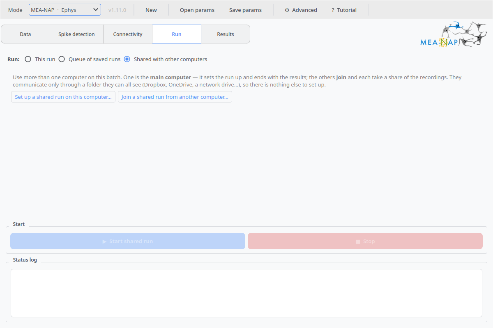

Press **Set up a shared run on this computer…**

### 3. On the desktop: the setup wizard

The first page says what you need.

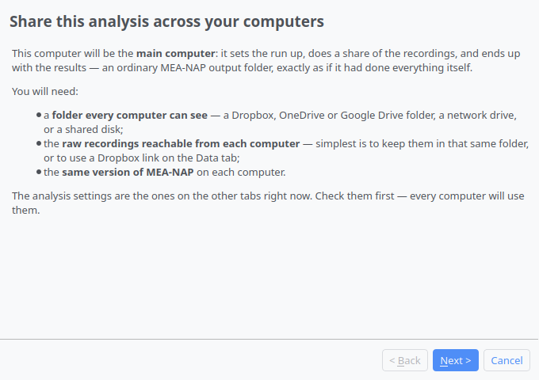

Next, choose the **shared folder** — the Dropbox (or OneDrive, network
drive…) folder both computers see — and a **run name**. The wizard tells you
whether the other computers will find the raw recordings on their own: they
will if the recordings are inside the shared folder, or come from a link.

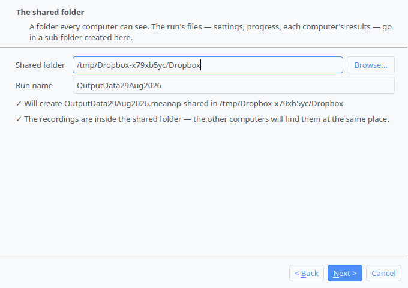

Next, name this computer. A short **benchmark** runs on its own — a few
seconds on a fast machine, up to a minute on a slow one — and reports a
relative speed. The split between computers is proportional to it.


Last, say where the pooled **results** should go on this computer. If the
name is already taken by an earlier run the wizard steps to `_v2`, so a
shared run never lands on top of something else.

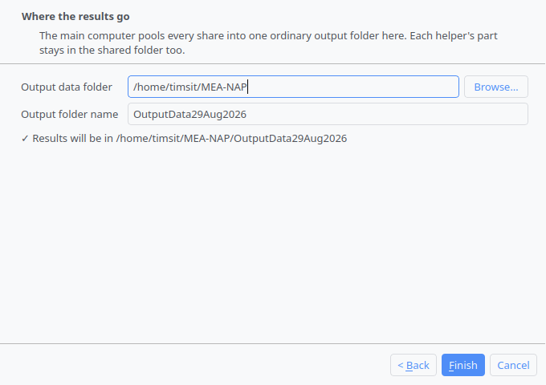

Press **Finish**. The shared page now shows the run's folder — the path
ending in `.meanap-shared` — and the status log spells out what to do on the
other computers.

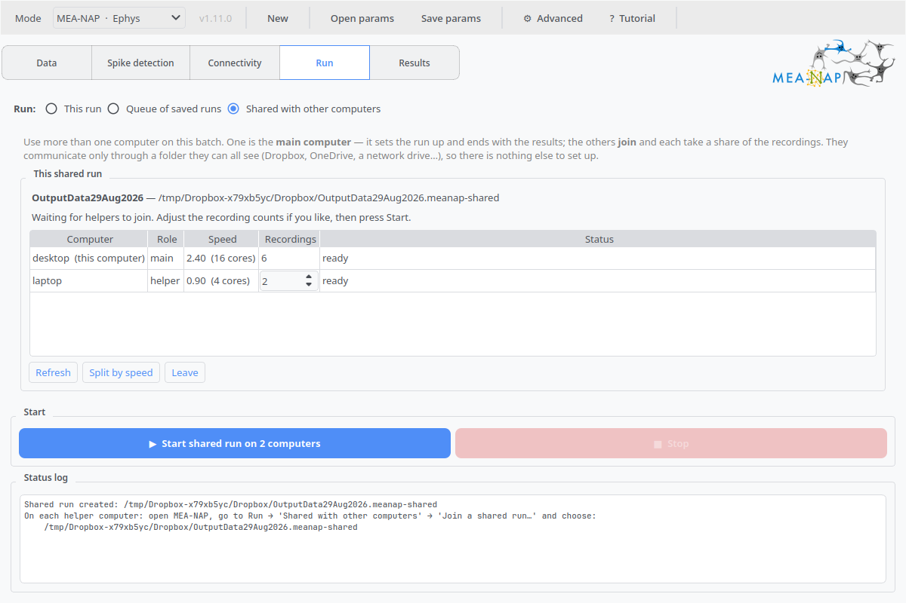

### 4. On the laptop: join

Open MEA-NAP → **Run** tab → **Shared with other computers** → **Join a shared
run from another computer…**

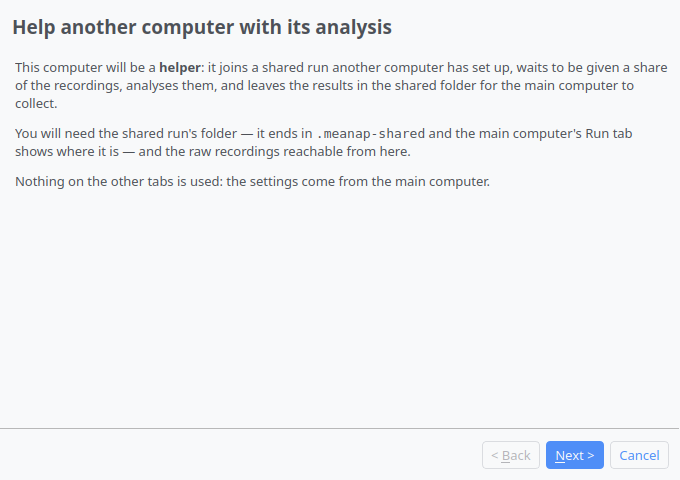

Pick the run's folder — the `….meanap-shared` path from the desktop's Run
tab, as it appears on *this* computer (`~/Dropbox/…` on a Mac,
`C:\Users\…\Dropbox\…` on Windows). The wizard reads the run and confirms
it is still open to join.

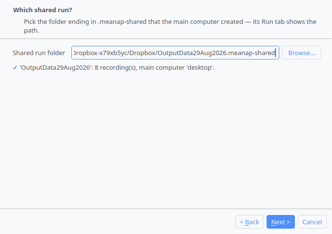

Next, the raw recordings. When they are in the shared folder they are found
without any help, as here; otherwise choose the folder that holds them on
this computer.

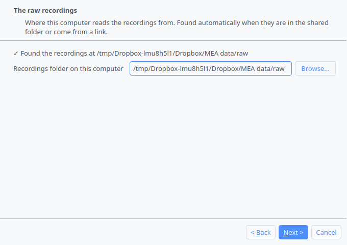

Then the benchmark, as on the desktop.

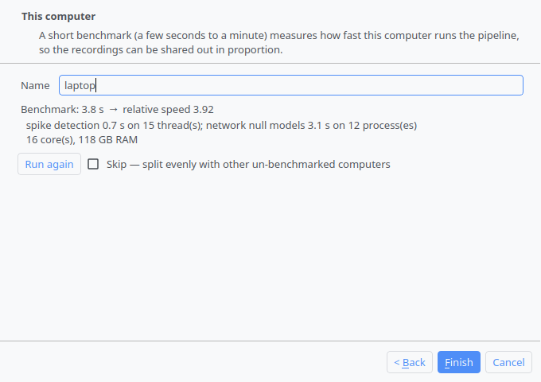

Press **Finish**. The laptop is now *joined and waiting*; its Run tab says so,
and nothing more needs doing here. Leave the window open.

### 5. On the desktop: start

Within a few seconds — the time the sync takes — the laptop appears in the
table with its speed. The **Recordings** column shows the proposed split:
proportional to speed, with the desktop taking the remainder. Change a
helper's count if you like (**Split by speed** puts the proportional split
back). Press **▶ Start shared run on 2 computers**.

### 6. Both computers work

Each computer works through its share. The desktop's own progress is in the
bar below the table; every computer's progress is in the table, refreshed
from the shared folder every few seconds.

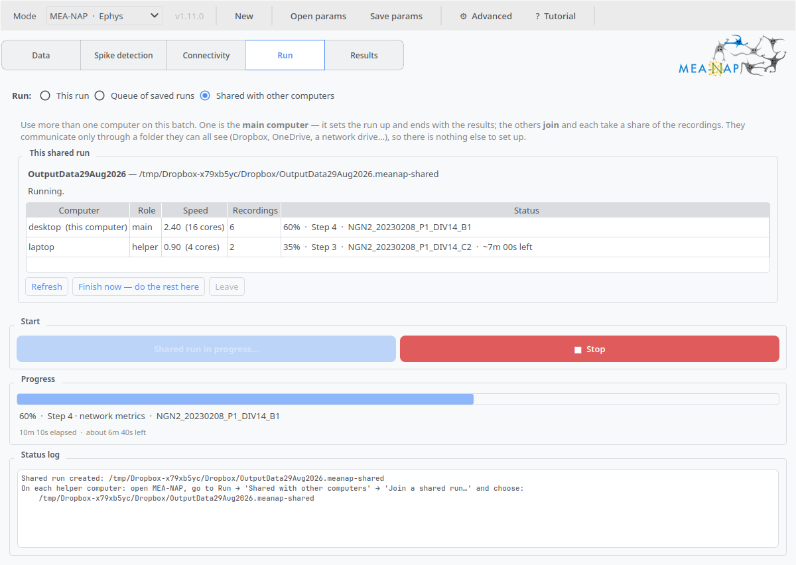

### 7. The desktop pools the results

When the laptop reports *done*, the desktop pools both parts and runs the
batch-wide analysis — group comparisons, the CSVs, the report — over all of
it. The Run tab then reads *Finished*, and the results are on the
**Results** tab, in the output folder chosen in step 3, exactly as for a
normal run.

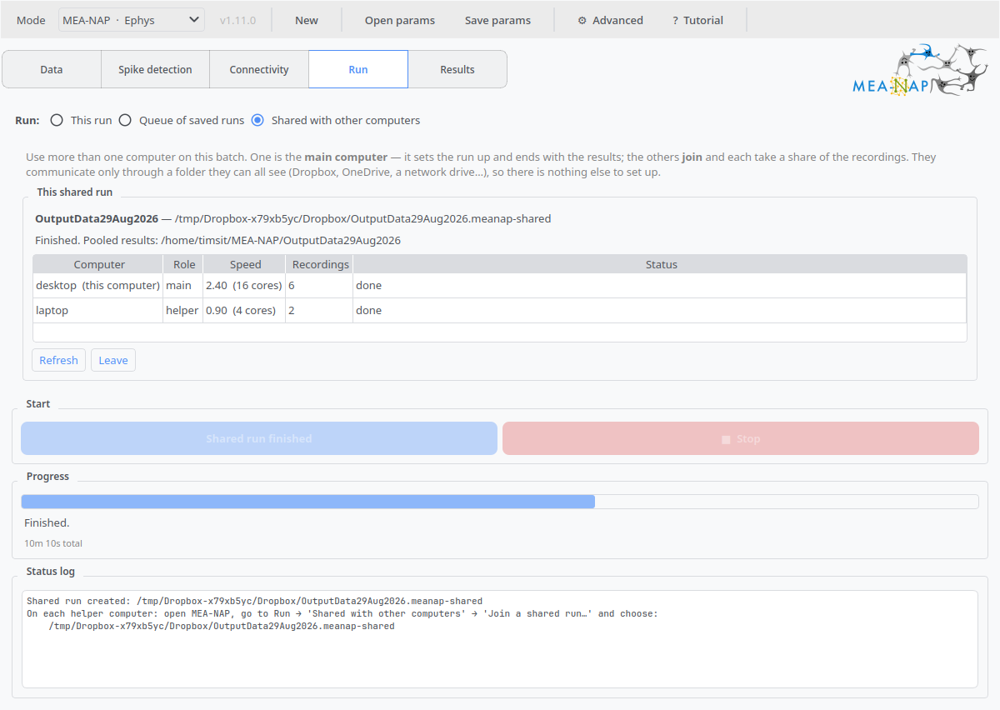

The laptop's window can be closed at any point after its share is done; its
part stays in the shared folder. Press **Leave** on either computer to
return the page to its two buttons — nothing in the shared folder is deleted.

## If a helper is slow, asleep, or gone

The main computer waits as long as it takes — there is no timeout, because a
laptop lid closing is not a failure. The table says how long it has been
since each computer last reported. If one is not coming back, press
**Finish now — do the rest here**: whatever it finished is pooled, and
whatever it did not is analysed on the main computer. The answer is the
same either way, only later.

**Stop** on the main computer ends the run for everyone: the helpers see the
change in the shared folder and stop after their current recording. Their
parts are kept, so **▶ Resume** later continues rather than restarts.
**Stop** on a helper stops only that helper; the main computer sees it as
*stopped* and can finish without it.

## Why the result is the same

A shared run is three ordinary mechanisms in sequence, none of them new:

1. Each computer's share is a normal run over a **subset spreadsheet** — the
   same columns, only its rows — into its own output folder. It runs as a
   *continued* run, which is what lets an interrupted helper carry on.
2. The main computer **merges** the parts: a file-level union of everything
   that belongs to one recording (spike times, adjacency, checks, figures)
   and a key-level union of step 4's `netmet_results.json`. Nothing computed
   across a share is carried over.
3. It then runs a **continued run over the full spreadsheet** in the merged
   folder — precisely the mechanism that [adds a recording to an existing
   run](changing-a-batch.md#adding-a-recording): every recording's own
   results are found and skipped; everything pooled across the batch is
   redone over all of them.

`python/test_shared_run.py` checks this end to end, with a helper running in
a separate process, against one uninterrupted run of the same batch: the
recording-level CSVs are identical. With **Fixed random seed** set, they are
identical to the last digit; without it the stochastic steps differ between
runs, as they always do.

## The shared folder

```
Run1.meanap-shared/
    shared_run.json        the run: settings, recordings, the split, status
    recordings.csv         the whole batch
    machines/
        desktop/
            machine.json   name, speed, version
            progress.json  how far it has got
            recordings.csv its share
            output/        its results — an ordinary output folder
        laptop/
            …
```

Every machine writes only its own `machines/<name>/` subtree; the main
computer alone writes `shared_run.json`. Two machines never write the same
file, so a sync service has nothing to make a "conflicted copy" of. Every
JSON file is written atomically, so a machine reading mid-sync sees the old
version or the new one, never half of either.

Streamed remote data is cached under `~/MEA-NAP/MEANAP-cache` on each
machine, never inside the shared folder — otherwise every byte fetched would
sync straight back out to the others.

## From a terminal

The same steps, for a computer without a screen (a workstation over SSH) or
for scripts:

```bash
meanap-shared create --params run.json --shared-folder ~/Dropbox/MEA-NAP --name Run1
meanap-shared join   ~/Dropbox/MEA-NAP/Run1.meanap-shared            # on each helper
meanap-shared start  ~/Dropbox/MEA-NAP/Run1.meanap-shared            # main, once they have joined
meanap-shared main   ~/Dropbox/MEA-NAP/Run1.meanap-shared --output-folder ~/MEA-NAP
meanap-shared status ~/Dropbox/MEA-NAP/Run1.meanap-shared
meanap-shared benchmark
```

`run.json` is a parameter file saved from the GUI's **Save params…**. A GUI
main computer and a terminal helper (or the reverse) mix freely.

## Limits

- **Express mode** is respected on every machine: each helper leaves a
  `.meanap` bundle rather than a folder, and the pooled run writes one too.
- **A helper that joins after Start** is not given a share. Stop, and start
  again, to include it.
- **Paths other than the raw data** — an external spike-data folder, a
  prior-analysis folder, a CAT-NAP cell-type file — are passed to the helpers
  as the main computer had them. Keep those inside the shared folder at the
  same relative place, or on the same absolute path, on every machine.
- **MEA-Stim.** The stimulation analysis is not split; it runs on the main
  computer during the pooled step, over every recording, and needs the raw
  voltage there.
- **Timing.** The split is by benchmark, not by recording size. A batch of
  very unequal recordings may finish unevenly; **Finish now** covers the gap.
  Step 1 reads a multi-gigabyte file per recording, so a helper reaching the
  data over Wi-Fi may spend longer copying than computing — a helper on the
  same network as the data, or with its own copy, helps far more.
